<p align="center">
  
</p>
<h1 align="center">Nexia CHAT (Flutter Messenger)</h1>

<p align="center">
  <a href="https://flutter.dev">
    
  </a>
  <a href="https://firebase.google.com">
    
  </a>
  <a href="https://webrtc.org">
    
  </a>
  <a href="LICENSE">
    
  </a>
</p>


A modern mobile messaging application built with Flutter, providing real-time chat, multimedia sharing, and video calls using Firebase and WebRTC.
The project was developed in an academic context with a focus on application architecture, user experience, and basic security considerations.

## 📸 Application Screenshots

### **0. Authentication**
<p align="center">
  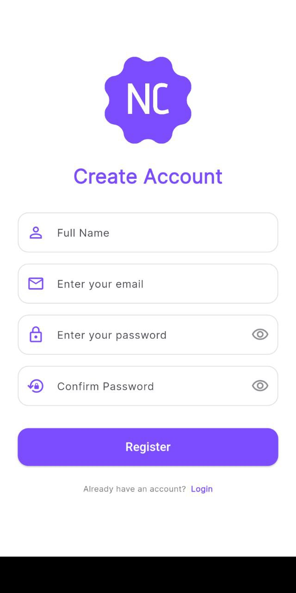
  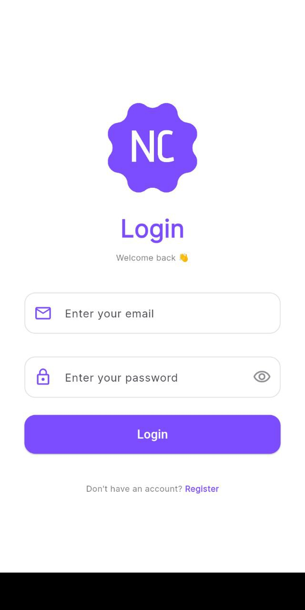
</p>

- User login screen
- User registration screen

---

### **1. Main Screens**
<p align="center">
  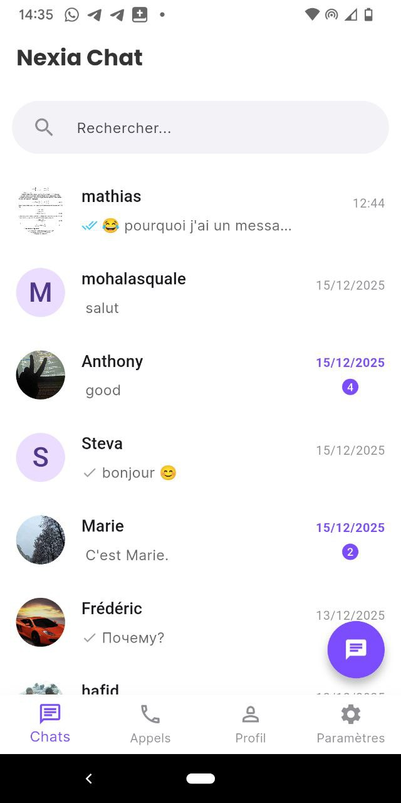
  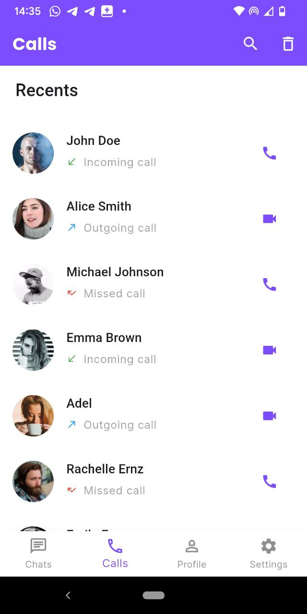
  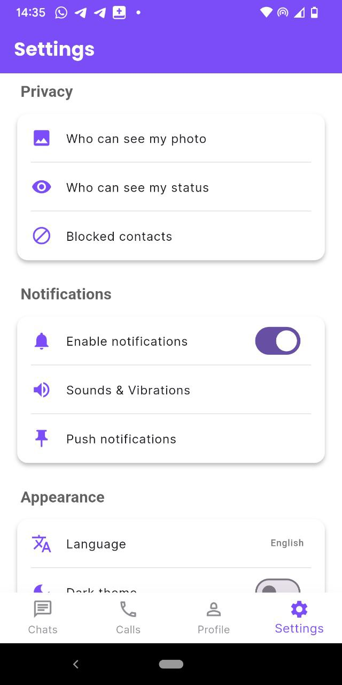
  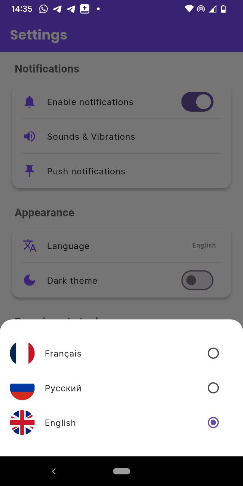
</p>

- Chat list overview  
- Call history screen  
- Application settings (general)  
- Application settings (languages)

---

### **2. Chat & User Interaction**
<p align="center">
  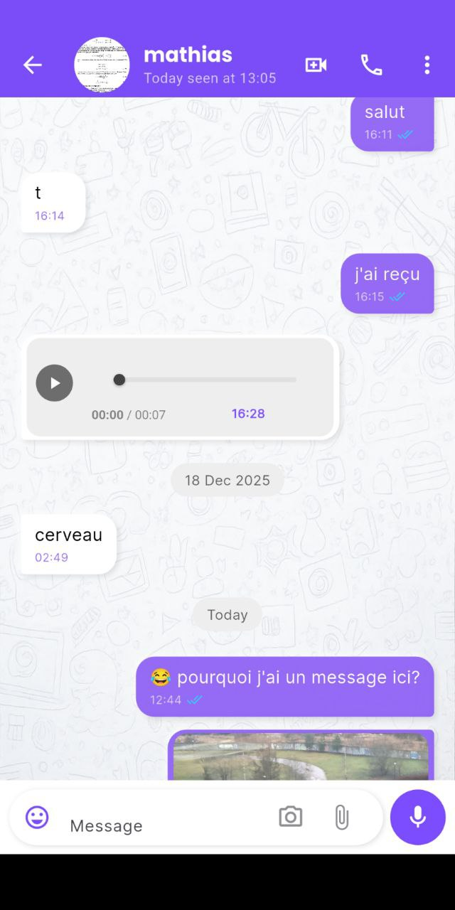
  
  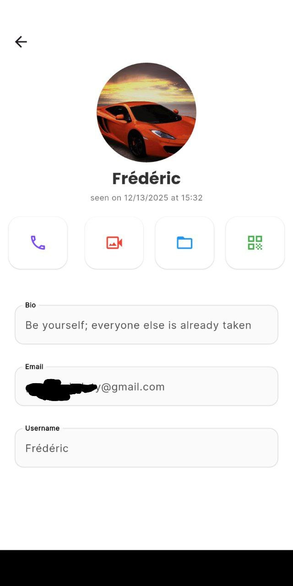
  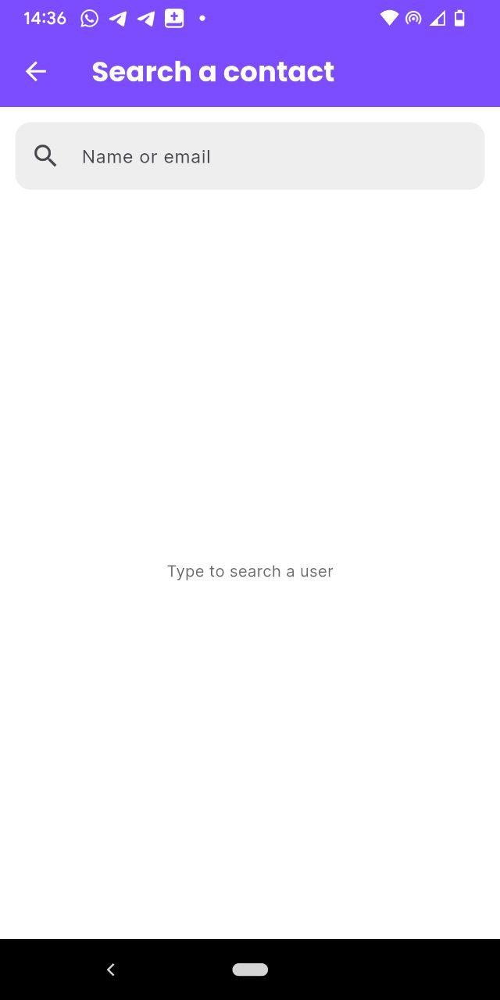
</p>

- Chat conversation interface  
- Media preview inside chat  
- User profile and details  
- User search screen  

---

### **3. Calls & File Sharing**
<p align="center">
  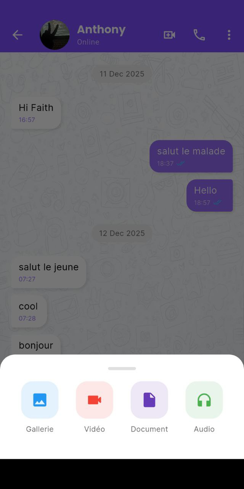
  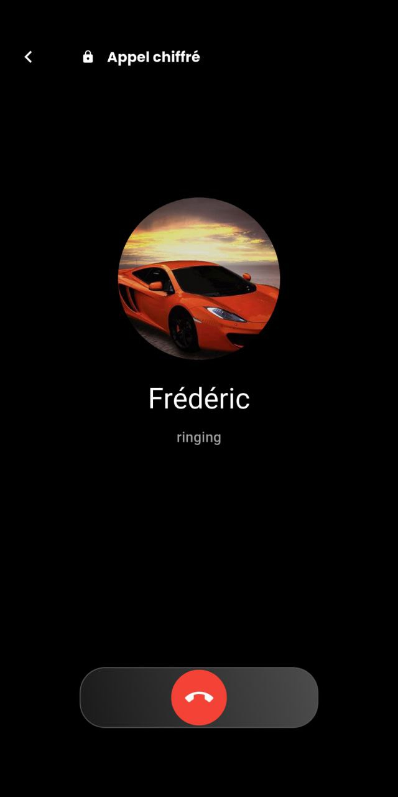
  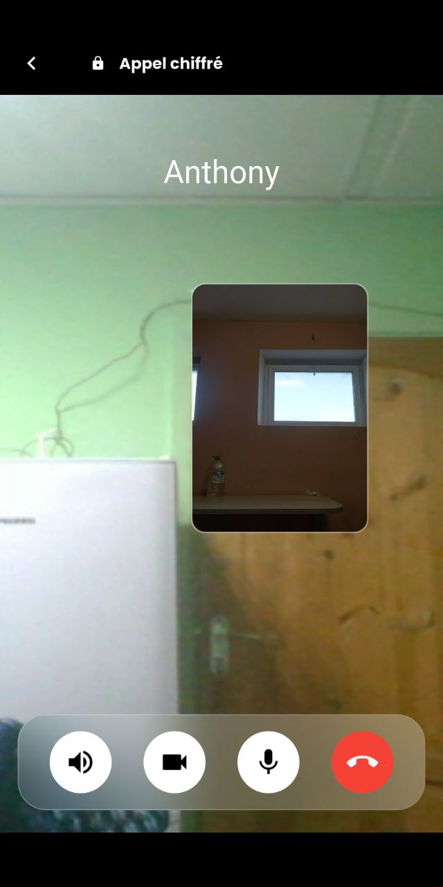
</p>

- File sharing interface  
- Call initiation screen  
- Video call  


## ✨ Features

###  Core Messaging
- **Real-time messaging** with Firestore
- **Message status tracking** (sent ✓, delivered ✓✓, read ✓✓)
- **File sharing** (images, videos, documents, audio)
- **User search and contact discovery**
- **Online / offline user presence**
- **Unread message counters** per conversation
- **Message grouping by date**
- **Local message caching** for improved performance

### **Media & Files**
- **Send and receive media and documents**, including:
  - **Images**
  - **Videos**
  - **Audio messages**
  - **Documents**
- **Media preview** directly inside the chat
- **Cloud storage** powered by Firebase

###  Communication
- **Peer-to-peer video calls** via WebRTC
- **Voice messaging** support
- **Optimized communication** for mobile networks


###  User Experience
- **Multi-language** (English, French, Russian)
- **Online presence** indicators
- **Push notifications** for new messages
- **Light/Dark theme** support


## 📁 Project Architecture

```lib/
├── main.dart                 # Application entry point
├── app/
│   ├── data/
│   │   ├── models/           # Data models (User, Message, Chat)
│   │   ├── providers/        # Firebase services
│   │   └── repositories/     # Business logic abstraction
│   ├── modules/
│   │   ├── auth/             # Authentication
│   │   ├── chat/             # Real-time messaging
│   │   ├── call/             # WebRTC video calls
│   │   ├── profile/          # User profile
│   │   └── settings/         # App settings
│   ├── services/             # Global services
│   ├── utils/                # Helpers & constants
│   └── widgets/              # Reusable widgets
└── generated/                # Generated files
```

## 🛠️ Tech Stack

| **Technology**        | **Usage**                   |
|----------------------|-----------------------------|
| **Flutter (Dart)**   | Mobile UI development       |
| **Firebase Auth**    | User authentication         |
| **Cloud Firestore**  | Real-time messaging         |
| **Firebase Storage** | Media file storage          |
| **WebRTC**           | Audio and video calls       |
| **Local Cache**      | Message caching             |

## 📚 Getting Started

### Prerequisites
- Flutter SDK 3.16 or higher
- Firebase account and project
- Android Studio / VS Code
- Physical device or emulator

### Installation

1. **Clone the repository**
```
git clone https://github.com/undescoreF/nexia_chat
```
2. **Install dependencies**
```
flutter pub get
```
3. **Firebase Setup(Android)**

```
flutterfire configure
```

4. **Configure environment variables**
```
Create.env file in root:

# Firebase
FIREBASE_API_KEY=your_firebase_api_key_here
FIREBASE_APP_ID=your_firebase_app_id_here
FIREBASE_PROJECT_ID=your_firebase_project_id_here
FIREBASE_MESSAGING_SENDER_ID=your_firebase_messaging_sender_id_here
FIREBASE_STORAGE_BUCKET=your_firebase_storage_bucket_here

# OneSignal
ONESIGNAL_APP_ID=your_onesignal_app_id_here
ONESIGNAL_REST_KEY=your_onesignal_rest_api_key_here
CHANEL_ID=your_onesignal_channel_id_here

# NAT
NAT_USERNAME=your_nat_username_here
NAT_CRED=your_nat_credentials_here

```

5. **Run the application**
```
flutter run
```
6.🔧 **Configuration** 
#### Firebase Rules
```
// Firestore security rules
rules_version = '2';
service cloud.firestore {
  match /databases/{database}/documents {
    match /messages/{chatId}/{message} {
      allow read, write: if request.auth != null 
        && request.auth.uid in resource.data.participants;
    }
  }
}
```
#### WebRTC Configuration
**Update STUN/TURN servers in lib/app/modules/call/services/webrtc_service.dart:**
```
final configuration = {
  'iceServers': [
    {'urls': 'stun:stun.l.google.com:19302'},
    {
    'urls': 'turn:your.turn.server',
     'username': 'user',
      'credential': 'pass'
      }
  ]
};
```
## 🔐 Security Notes

This project integrates basic mobile security practices, including:
- **Secure authentication** using Firebase
- **HTTPS-encrypted communication**
- **Controlled access** through Firebase security rules
- **Limited and scoped local caching**
- **Proper permission handling** on Android

Basic security checks were performed on:
- **Local cache content**
- **Firebase configuration**
- **Network traffic**
- **Application permissions**

> This project does not claim full end-to-end encryption and is intended for **educational purposes only**.

## Future Improvements

The app is functional, but there are several planned improvements to enhance performance, usability, and security:  

- **Enhanced Audio & Video Calls**  
  - Improve call quality and stability on mobile networks.  
  - Refine UI/UX for call screens (in-call controls, participant info, call duration).  
  - Add group calling support.  

- **End-to-End Encryption (E2EE)**  
  - Implement full encryption for messages and media to ensure privacy.  
  - Encrypt video and audio streams during WebRTC calls.  
  - Secure encryption key management.  

- **Advanced Data Security**  
  - Harden Firebase rules for fine-grained access control.   
  - Improve local cache encryption and storage security.  

- **User Experience Enhancements**  
  - Add chat reactions and message editing/deletion.  
  - Smooth animations for sending/receiving messages and file uploads.  
  - Multi-device support (sync across phone and tablet). 

- **Performance & Scalability**  
  - Optimize database queries for large message histories.  
  - Reduce app startup time and memory usage.  
  
- **Analytics & Monitoring**  
  - Integrate crash reporting and performance monitoring.  
  - Track app usage metrics for future optimization.  


  


